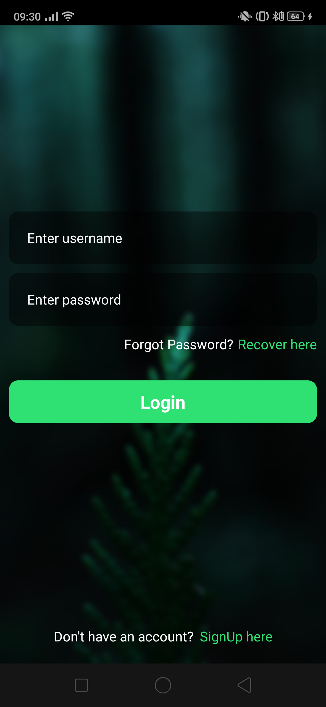
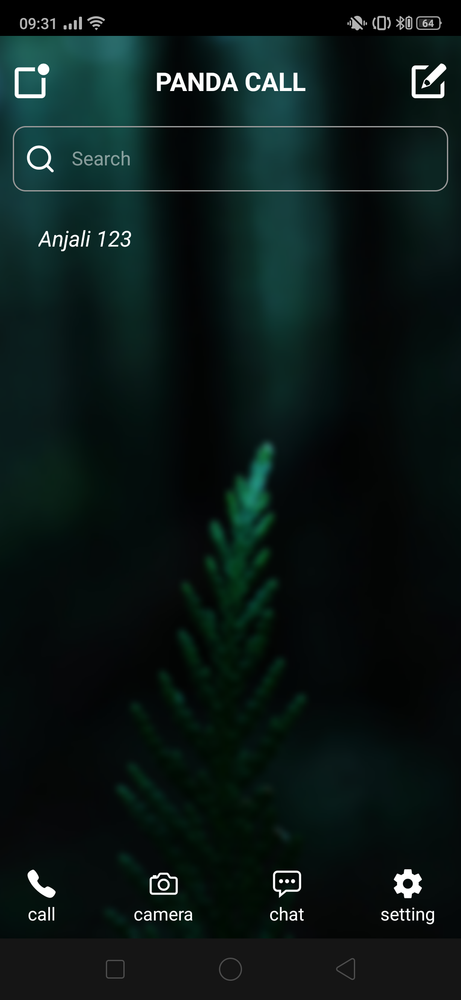
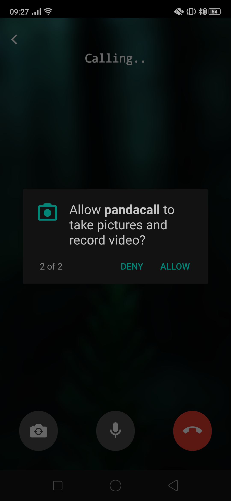
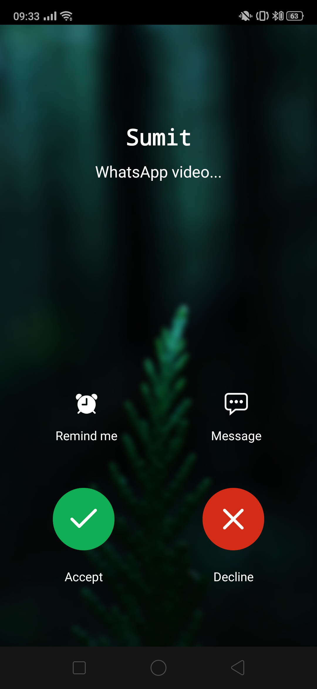
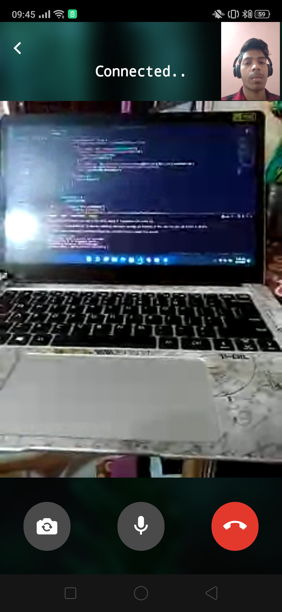

# Video-Call-App ( React Native + Django + Voximplant) 

  
  
  
 

  
  
  
 

# Changes you have to made

1. In Backend , there is no change simple host your backend server i.e, pythonanywhere.com etc..
2. In Frontend , edit Constants.js in put API_URL instead of https://localhost:8000 i.e, https://example.com

# Note
React native axios request will give error while fetching data from backend as localhost is not allowed in react-native-axios you can connect your localhost port to a public url using ngrok easily using command - ngrok.exe http 8000 > hit Enter and then metioned that url in Constants.js . Check this out you will love it , otherwise you need a domain name , or you can host backend on free platform like pythonanywhere.com etc...

# Enjoy 🥳🥳🥳🥳
